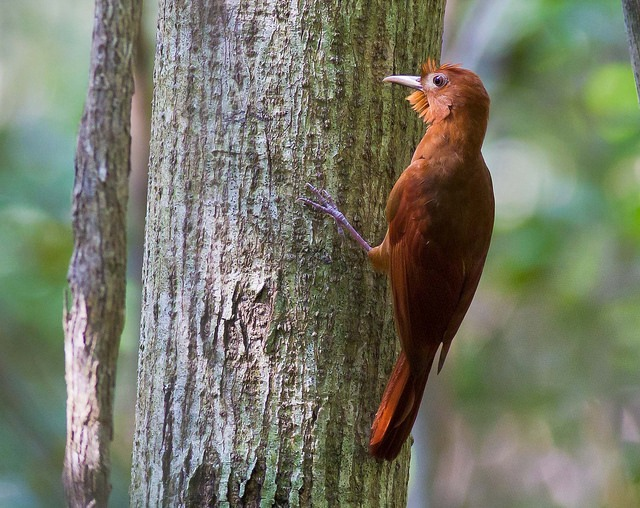
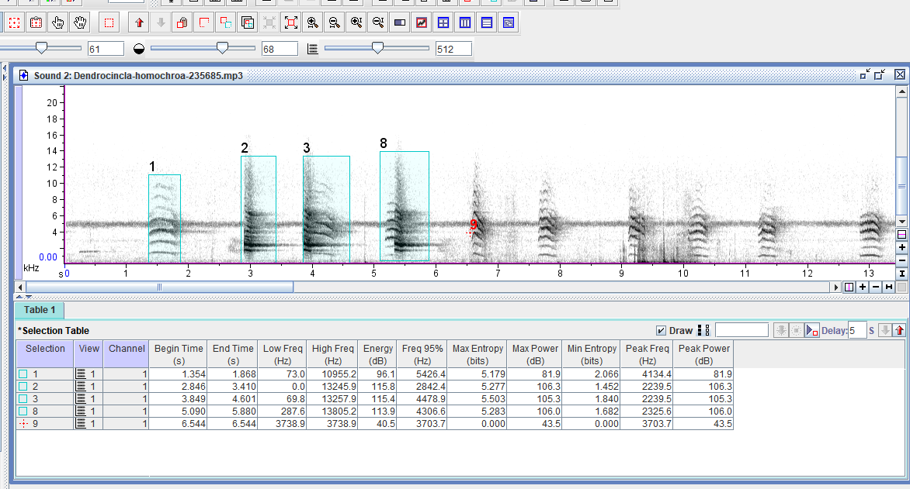
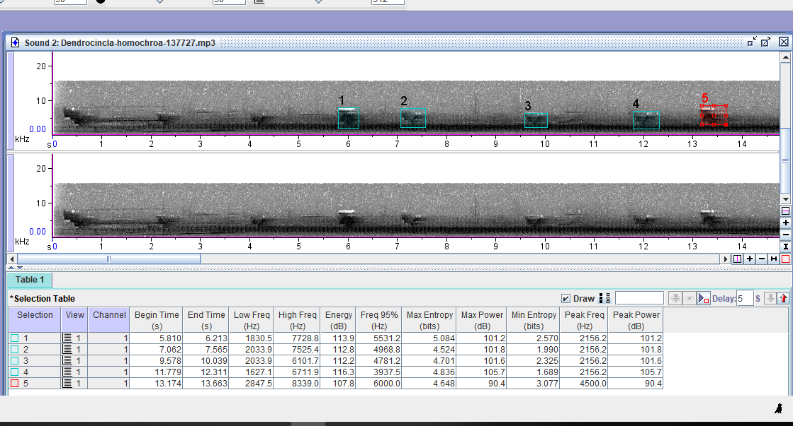

**Nombre cientifico**:  *Dendrocincla homochroa*

Trepatroncos mediano poco común de bosques tropicales húmedos, rara vez se le ve lejos de enjambres de hormigas. Se le encuentra solo o en grupos de dos o tres, a veces con Tawny-winged y Northern Barred Woodcreepers entre las hormigas. Generalmente se percha muy recto sobre troncos delgados muy cerca del suelo, menos común en niveles medios. Suele ser un poco lento. La combinación de su plumaje rojizo brillante junto con su conducta lo hace distintivo. Note también el anillo ocular grisáceo. Usualmente es bastante callado; a veces da un llamado como maullido lastimero y su canto es un chipeo cascabeleado.

\
\
\
\

$$
$$

## Métricas de llamados

$$
$$

Estas son las métricas del llamado y el canto del Trepatroncos rojizo, el primero fue grabado por Niels Krabbe en Colombia y el canto fue grabado en Costa Rica por Paul Driver. Las grabaciones fueron extraídas de [Xeno-canto](https://www.xeno-canto.org)

## Llamado

$$
$$

$$
$$

# Canto

$$
$$

