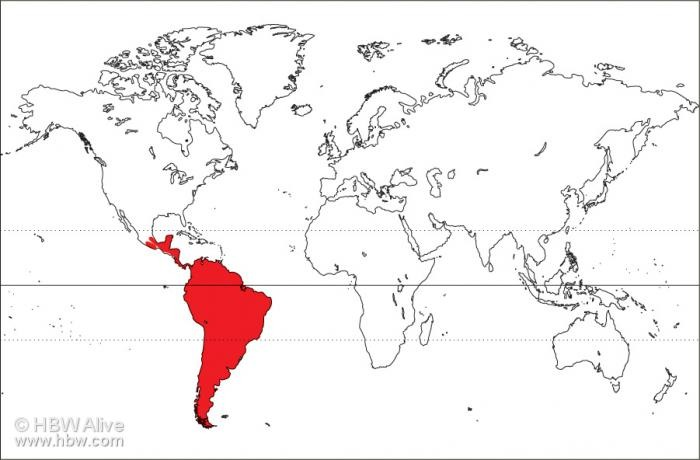

Se distribuye ampliamente por suramérica desde las bajuras hasta los parámos; siembargo ninguna especie se ha distibuido al norte de México ni ha llegado hasta las Antillas. En Costa Rica su ditribución abarca todo el país.

