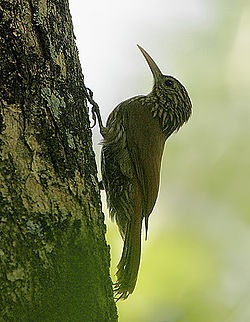

Furnariidae es una familia de aves del orden Passeriformes, contiene cerce de 240 especies, es uno de los grupos más diversos. Su alimentación consiste casi por completo en insectos y otros invertebrados pequeños, los cuáles puede conseguirse de las formas más diversas sobre el follaje, trepando a los troncos o picoteando los tallos.

